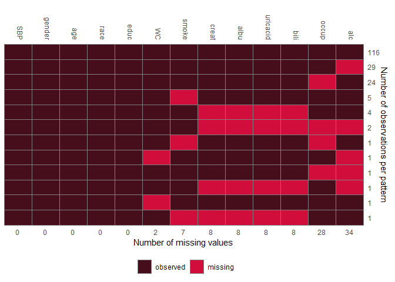
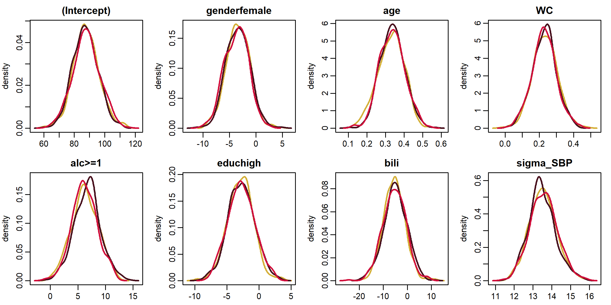

<!-- README.md is generated from README.Rmd. Please edit that file -->

# JointAI: Joint Analysis and Imputation of Incomplete Data 

<!-- badges: start -->

[](https://CRAN.R-project.org/package=JointAI)
[](https://CRAN.R-project.org/package=JointAI)
[](https://cran.r-project.org/package=JointAI)
[](https://app.codecov.io/gh/NErler/JointAI)
[](https://travis-ci.org/NErler/JointAI)
[](https://github.com/NErler/JointAI/actions)
<!-- badges: end -->

The package **JointAI** provides functionality to perform joint analysis
and imputation of a range of model types in the Bayesian framework.
Implemented are (generalized) linear regression models and extensions
thereof, models for (un-/ordered) categorical data, as well as
multi-level (mixed) versions of these model types.

Moreover, survival models and joint models for longitudinal and survival
data are available. It is also possible to fit multiple models of mixed
types simultaneously. Missing values in (if present) will be imputed
automatically.

**JointAI** performs some preprocessing of the data and creates a
[JAGS](https://mcmc-jags.sourceforge.io/) model, which will then
automatically be passed to [JAGS](https://mcmc-jags.sourceforge.io/)
with the help of the R package
[**rjags**](https://CRAN.R-project.org/package=rjags).

Besides the main modelling functions, **JointAI** also provides a number
of functions to summarize and visualize results and incomplete data.

## Installation

**JointAI** can be installed from [CRAN](https://cran.r-project.org/):

``` r
install.packages('JointAI')
```

Alternatively, you can install **JointAI** from GitHub:

``` r
# install.packages("remotes")
remotes::install_github("NErler/JointAI")
```

## Main functions

**JointAI** provides the following main functions:

``` r
lm_imp()                 # linear regression
glm_imp()                # generalized linear regression
clm_imp()                # cumulative logit model
mlogit_imp()             # multinomial logit model
lognorm_imp()            # log-normal regression
betareg_imp()            # beta regression
lme_imp() / lmer_imp()   # linear mixed model
glme_imp() / glmer_imp() # generalized linear mixed model
clmm_imp()               # cumulative logit mixed model
mlogitmm_imp()           # multinomial logit model
lognormmm_imp()          # log-normal regression
betamm_imp()             # beta regression
survreg_imp()            # parametric (Weibull) survival model
coxph_imp()              # proportional hazards survival model
JM_imp()                 # joint model for longitudinal and survival data
```

The functions use specification similar to that of well known standard
functions like `lm()` and `glm()` from base R, `nlme::lme()` (from the
package [**nlme**](https://CRAN.R-project.org/package=nlme)) ,
`lme4::lmer()` or `lme4::glmer()` (from the package
[**lme4**](https://CRAN.R-project.org/package=lme4)) and
`survival::survreg()` and `survival::coxph()` (from the package
[**survival**](https://CRAN.R-project.org/package=survival)).

Functions `summary()`, `coef()`, `traceplot()` and `densplot()` provide
a summary of the posterior distribution and its visualization.

`GR_crit()` and `MC_error()` implement the Gelman-Rubin diagnostic for
convergence and the Monte Carlo error of the MCMC sample, respectively.

**JointAI** also provides functions for exploration of the distribution
of the data and missing values, export of imputed values and prediction.

## Minimal Example

### Visualize the observed data and missing data pattern

``` r
library(JointAI)

plot_all(NHANES[c(1, 5:6, 8:12)], fill = '#D10E3B', border = '#460E1B', ncol = 4, breaks = 30)
```


``` r
md_pattern(NHANES, color = c('#460E1B', '#D10E3B'))
```



### Fit a linear regression model with incomplete covariates

``` r
lm1 <- lm_imp(SBP ~ gender + age + WC + alc + educ + bili,
              data = NHANES, n.iter = 500, progress.bar = 'none', seed = 2020)
```

### Visualize the MCMC sample

``` r
traceplot(lm1, col = c('#d4af37', '#460E1B', '#D10E3B'), ncol = 4)
```


``` r
densplot(lm1, col = c('#d4af37', '#460E1B', '#D10E3B'), ncol = 4, lwd = 2)
```



### Summarize the Result

``` r
summary(lm1)
#> 
#> Bayesian linear model fitted with JointAI
#> 
#> Call:
#> lm_imp(formula = SBP ~ gender + age + WC + alc + educ + bili, 
#>     data = NHANES, n.iter = 500, seed = 2020, progress.bar = "none")
#> 
#> 
#> Posterior summary:
#>                Mean     SD     2.5%   97.5% tail-prob. GR-crit MCE/SD
#> (Intercept)  87.662 8.6088  70.3830 104.899    0.00000    1.00 0.0271
#> genderfemale -3.487 2.2407  -7.9563   0.818    0.10533    1.01 0.0258
#> age           0.334 0.0683   0.1986   0.468    0.00000    1.01 0.0258
#> WC            0.230 0.0721   0.0876   0.376    0.00133    1.00 0.0258
#> alc>=1        6.419 2.3862   1.6656  11.112    0.00667    1.03 0.0358
#> educhigh     -2.805 2.0681  -6.9371   1.339    0.17067    1.00 0.0258
#> bili         -5.277 4.7332 -14.7727   3.596    0.25333    1.01 0.0275
#> 
#> Posterior summary of residual std. deviation:
#>           Mean    SD 2.5% 97.5% GR-crit MCE/SD
#> sigma_SBP 13.5 0.725 12.2    15    1.01 0.0258
#> 
#> 
#> MCMC settings:
#> Iterations = 101:600
#> Sample size per chain = 500 
#> Thinning interval = 1 
#> Number of chains = 3 
#> 
#> Number of observations: 186
```

``` r
coef(lm1)
#> $SBP
#>  (Intercept) genderfemale          age           WC       alc>=1     educhigh 
#>   87.6622381   -3.4873104    0.3335133    0.2302755    6.4194926   -2.8054874 
#>         bili    sigma_SBP 
#>   -5.2768560   13.5278177

confint(lm1)
#> $SBP
#>                      2.5%       97.5%
#> (Intercept)   70.38301720 104.8986161
#> genderfemale  -7.95631510   0.8182921
#> age            0.19857014   0.4678630
#> WC             0.08761699   0.3756334
#> alc>=1         1.66562640  11.1121370
#> educhigh      -6.93714769   1.3389344
#> bili         -14.77269911   3.5955383
#> sigma_SBP     12.16165429  15.0367180
```
