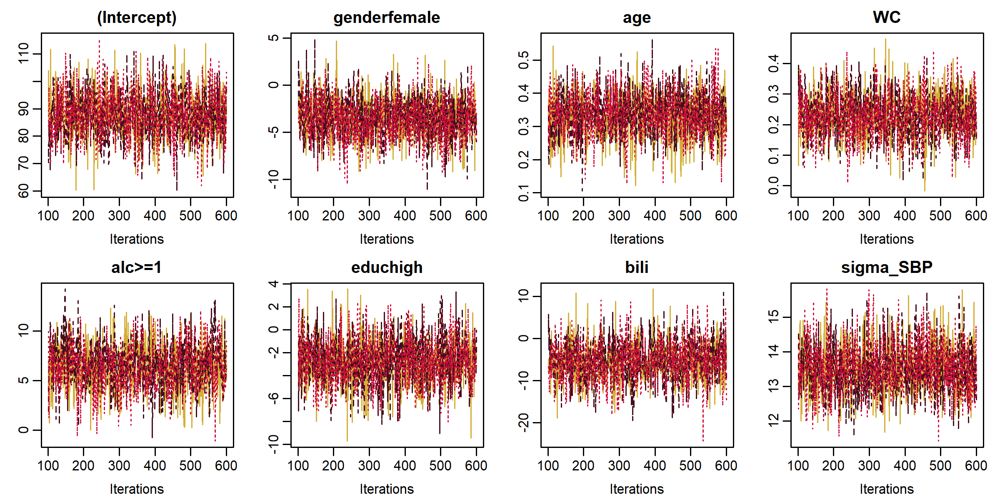

<!-- README.md is generated from README.Rmd. Please edit that file -->

# JointAI: Joint Analysis and Imputation of Incomplete Data

[](https://travis-ci.org/NErler/JointAI)
[](https://CRAN.R-project.org/package=JointAI)
[](https://CRAN.R-project.org/package=JointAI)
[](https://cran.r-project.org/package=JointAI)
[](http://www.rdocumentation.org/packages/JointAI)

The package **JointAI** provides joint analysis and imputation of
(generalized) linear regression models, (generalized) linear mixed
models and parametric (Weibull) survival models with incomplete
(covariate) data in the Bayesian framework.

The package performs some preprocessing of the data and creates a
[JAGS](http://mcmc-jags.sourceforge.net) model, which will then
automatically be passed to [JAGS](http://mcmc-jags.sourceforge.net) with
the help of the R package
[**rjags**](https://CRAN.R-project.org/package=rjags).

**JointAI** also provides summary and plotting functions for the output.

## Installation

You can install **JointAI** from GitHub with:

``` r
# install.packages("devtools")
devtools::install_github("NErler/JointAI")
```

## Main functions

Currently, there are three main functions that perform linear,
generalized linear or linear mixed regression:

``` r
lm_imp()
glm_imp()
lme_imp()
glme_imp()
survreg_imp()
```

`lm_imp()` and `glm_imp()` use specification similar to their complete
data counterparts `lm()` and `glm()`, whereas `lme_imp()` uses similar
specification as `lme()` from the package
[**nlme**](https://CRAN.R-project.org/package=nlme). `glme_imp()` uses a
combination of the specifications from `glm()` (with regards to the
family) and `lme` (with regards to the random effects structure).
`survreg_imp()` is a missing data version of `survreg` from the package
[**survival**](https://CRAN.R-project.org/package=survival).

Functions `summary()`, `traceplot()`, `densityplot()` provide a summary
of the posterior distribution and its visualization.

`GR_crit()` and `MC_error()` provide the Gelman-Rubin diagnostic for
convergence and the Monte Carlo error of the MCMC sample, respectively.

## Minimal Example

### Visualize the observed data and missing data pattern

``` r
library(JointAI)

par(mar = c(2.5, 3, 2.5, 1), mgp = c(2, 0.8, 0))
plot_all(NHANES[c(1, 5:6, 8:12)], fill = '#18bc9c', border = '#2C3E50', ncol = 4, nclass = 30)
```


``` r
md_pattern(NHANES, color = c('#2C3E50', '#18bc9c'))
```


### Fit a linear regression model with incomplete covariates

``` r
lm1 <- lm_imp(SBP ~ gender + age + WC + alc + educ + bili,
              data = NHANES, n.iter = 500, progress.bar = 'none')
```

### Visualize the MCMC sample

``` r
traceplot(lm1, col = c('#E74C3C', '#2C3E50', '#18bc9c'), ncol = 4)
```


``` r
densplot(lm1, col = c('#E74C3C', '#2C3E50', '#18bc9c'), ncol = 4, lwd = 2)
```



### Summarize the Result

``` r
summary(lm1)
#> 
#>  Linear model fitted with JointAI 
#> 
#> Call:
#> lm_imp(formula = SBP ~ gender + age + WC + alc + educ + bili, 
#>     data = NHANES, n.iter = 500, progress.bar = "none")
#> 
#> Posterior summary:
#>                Mean     SD    2.5%   97.5% tail-prob. GR-crit
#> (Intercept)  88.138 8.8987  70.907 105.004    0.00000   1.016
#> genderfemale -3.493 2.2629  -7.995   0.733    0.11333   1.026
#> age           0.333 0.0698   0.198   0.471    0.00000   0.999
#> educhigh     -2.834 2.1179  -6.937   1.213    0.17600   1.001
#> WC            0.226 0.0727   0.087   0.365    0.00133   1.006
#> bili         -5.325 4.8712 -14.671   4.107    0.27867   1.034
#> alc>=1        6.474 2.3852   1.617  10.975    0.00800   1.008
#> 
#> Posterior summary of residual std. deviation:
#>           Mean    SD 2.5% 97.5% GR-crit
#> sigma_SBP 13.6 0.713 12.3  15.1       1
#> 
#> 
#> MCMC settings:
#> Iterations = 101:600
#> Sample size per chain = 500 
#> Thinning interval = 1 
#> Number of chains = 3 
#> 
#> Number of observations: 186
```

``` r
coef(lm1)
#>  (Intercept) genderfemale          age     educhigh           WC 
#>   88.1376999   -3.4929987    0.3329173   -2.8344294    0.2261967 
#>         bili       alc>=1 
#>   -5.3246059    6.4737628

confint(lm1)
#>                      2.5%       97.5%
#> (Intercept)   70.90745371 105.0043681
#> genderfemale  -7.99483709   0.7328822
#> age            0.19811543   0.4708507
#> educhigh      -6.93670692   1.2126142
#> WC             0.08699786   0.3646676
#> bili         -14.67086056   4.1073254
#> alc>=1         1.61683002  10.9745147
#> sigma_SBP     12.29417867  15.0952757
```
