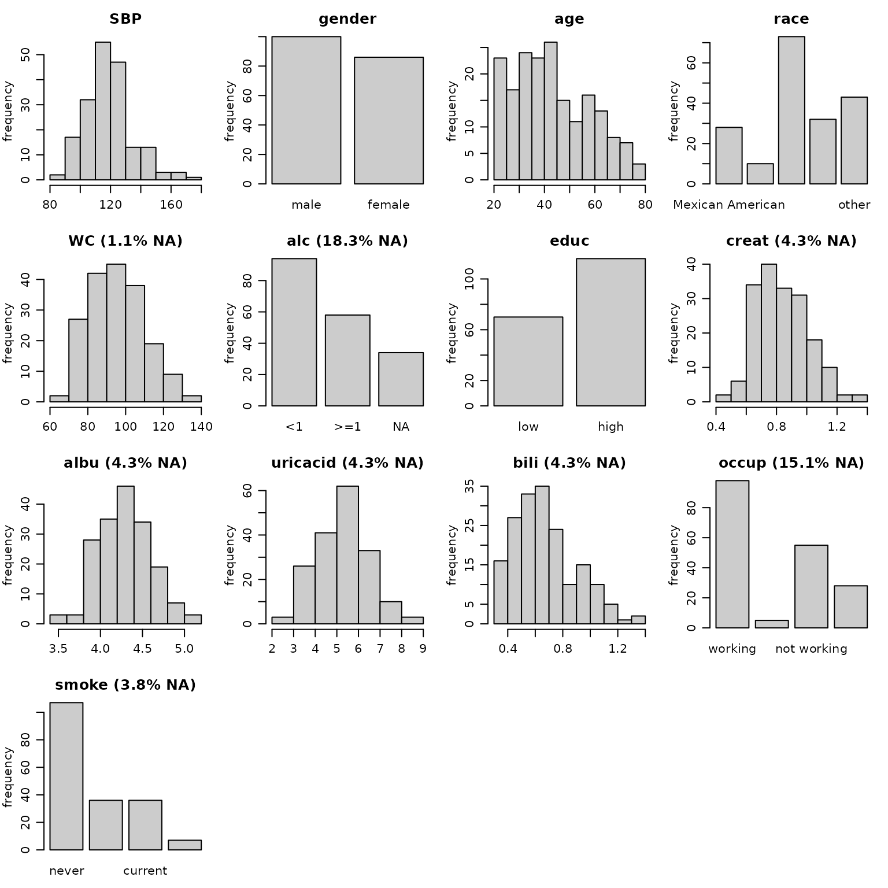
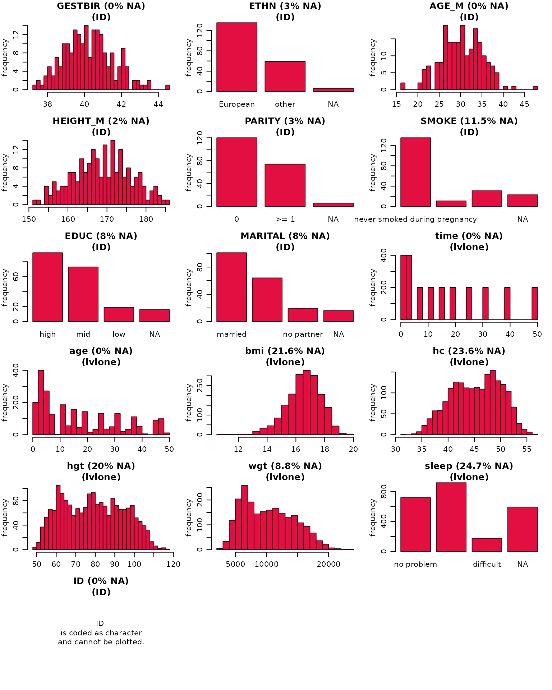
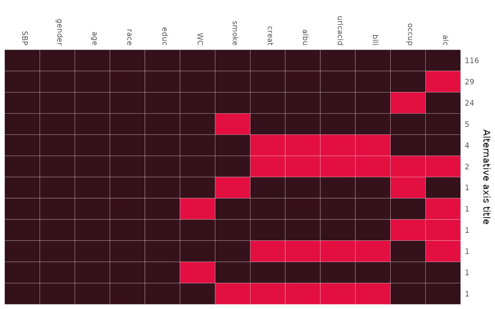

# Visualizing Incomplete Data

When analysing data with missing values it is important to be familiar
with the variables of interest, i.e., to know their measurement level
and distribution, as well as the amount of missing values per variable,
and to investigate the pattern of missing values.

Currently, the package **JointAI** has two functions to help the
exploration of incomplete data.

In this vignette, we use the `NHANES` data and the `simLong` data, that
are part of the **JointAI** package. For more info on these datasets,
check the help files [for the
`NHANES`](https://nerler.github.io/JointAI/reference/NHANES.html) and
[for the
`simLong`](https://nerler.github.io/JointAI/reference/simLong.html) data
or go to the [web page of the National Health and Nutrition Examination
Survey (NHANES)](https://www.cdc.gov/nchs/nhanes/index.htm).

## Visualize the distribution of each variable

Using [`plot_all()`](../reference/plot_all.md), an array of histograms
(for continuous variables and dates) and bar plots (for categorical
variables) can be obtained.

``` r
op <- par(mar = c(2.5, 3, 2.5, 1), mgp = c(2, 0.8, 0))
plot_all(NHANES)
```



``` r
par(op)
```

**Note:** Here, we are looking at the marginal distribution of each
variable. Since missing values are (usually) imputed conditionally on
other variables, marginal plots can only be used as an indication of
what type of imputation model (e.g., normal vs non-normal) is
appropriate.

### Plot titles: proportion of missing values

The argument `allNA` allows to select whether the proportion of missing
values is given only for incomplete variables or, by setting
`allNA = TRUE`, for all variables.

### Changing colors

The colour of the bars and their border can be controlled with the
arguments `fill` and `border`.

### Layout

The number of rows and columns of the plot layout is determined
automatically depending on the number of variables in the data but can
be overwritten using `nrow` and/or `ncol`.

### Additional arguments

It is also possible to provide some of the other arguments of
[`hist()`](https://stat.ethz.ch/R-manual/R-devel/library/graphics/html/hist.html)
or
[`barplot()`](https://stat.ethz.ch/R-manual/R-devel/library/graphics/html/barplot.html).

For example:

``` r
par(mar = c(2.5, 3, 2.5, 1), mgp = c(2, 0.8, 0))
plot_all(NHANES, allNA = TRUE, fill = '#e30f41', border = '#34111b', ncol = 3, breaks = 30)
```


### Multi-level data

When the data has a multi-level structure, e.g., subjects are nested
within hospitals, or subjects have been measured repeatedly as in the
`simLong` data, the level of each variable can be taken into account by
specifying the names of the grouping variables (“id” variables) via the
argument `idvars`.

``` r
par(mar = c(2.5, 3, 2.5, 1), mgp = c(2, 0.8, 0))
plot_all(simLong, allNA = TRUE, fill = '#e30f41', border = '#34111b',
         ncol = 3, breaks = 30, idvars = "ID")
```


The information to which level a variable belongs is added to the title
of each plot (“lvlone” refers to the first level, for which there is no
grouping variable). Variables belonging to higher levels (e.g.,
center-specific variables in a multi-center setting, or patient-specific
variables in a setting with repeated measurements for each patient) are
summarized on their respective level, i.e., the counts of `ETHN`, for
instance, will sum up to the number of subjects in the `simLong` data.

## Missing Data Pattern

The pattern of the missing data can be visualized with the function
[`md_pattern()`](../reference/md_pattern.md):

``` r
md_pattern(NHANES)
```


In the resulting plot, variables are given in the columns and each row
corresponds to one pattern of missingness across the variables. The
numbers on the right margin give the number of cases per pattern.
Underneath the plot, the number of missing values per variable is given.
Columns are automatically sorted by number of missing values, rows by
number of cases per pattern.

The plot is generated with the help of
[`ggplot()`](https://ggplot2.tidyverse.org/), and, hence, the package
[**ggplot2**](https://CRAN.R-project.org/package=ggplot2) needs to be
installed. By setting `plot = FALSE`, no plot will be generated (and
then **ggplot2** is not required).

#### Missing data pattern as a matrix

When the argument `pattern = TRUE` is set, the missing data pattern is
returned as a matrix, where observed values are represented by `1` and
missing values by `0`:

``` r
md_pattern(NHANES, pattern = T, plot = F)
#>      SBP gender age race educ WC smoke creat albu uricacid bili occup alc Npat
#> 1      1      1   1    1    1  1     1     1    1        1    1     1   1  116
#> 2      1      1   1    1    1  1     1     1    1        1    1     1   0   29
#> 3      1      1   1    1    1  1     1     1    1        1    1     0   1   24
#> 4      1      1   1    1    1  1     0     1    1        1    1     1   1    5
#> 5      1      1   1    1    1  1     1     0    0        0    0     1   1    4
#> 6      1      1   1    1    1  1     1     0    0        0    0     0   0    2
#> 7      1      1   1    1    1  1     0     1    1        1    1     0   1    1
#> 8      1      1   1    1    1  0     1     1    1        1    1     1   0    1
#> 9      1      1   1    1    1  1     1     1    1        1    1     0   0    1
#> 10     1      1   1    1    1  1     1     0    0        0    0     1   0    1
#> 11     1      1   1    1    1  0     1     1    1        1    1     1   1    1
#> 12     1      1   1    1    1  1     0     0    0        0    0     1   1    1
#> Nmis   0      0   0    0    0  2     7     8    8        8    8    28  34  103
```

### Changing colors

The arguments `color` and `border` can be used to change the colour that
is used for observed and missing values (in that order, i.e., `color` is
a vector of length two), and the border separating the rectangles,
respectively.

### Legend position

The position of the legend can be controlled with the argument
`legend.position`, which can be one of `"left"`, `"right"`, `"bottom"`
or `"top"`. When `legend.position = 'none'`, no legend is printed.

### Changing the axes

To hide the x-axis, the argument `print_xaxis` can be set to `FALSE`.
With the corresponding argument `print_yaxis = FALSE` the y-axis can be
omitted.

To change the title of the y-axis, you can change the argument `ylab`.
Setting `ylab = ''` will hide the axis title, but keep the number of
observations per missing data pattern.

``` r
md_pattern(NHANES, color = c('#34111b', '#e30f41'), border = 'white',
           legend.position = 'none', print_xaxis = FALSE,
           ylab = 'Alternative axis title')
```



  

For the `simLong` data, the missing data pattern is:

``` r
md_pattern(simLong, color = c('#34111b', '#e30f41'))
```


