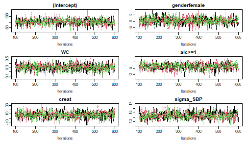
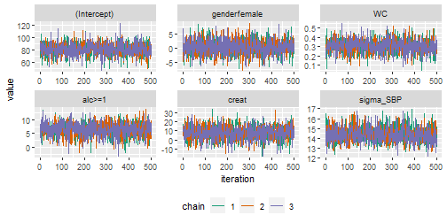
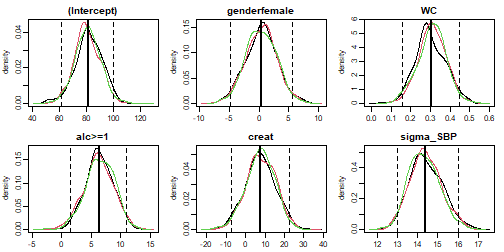
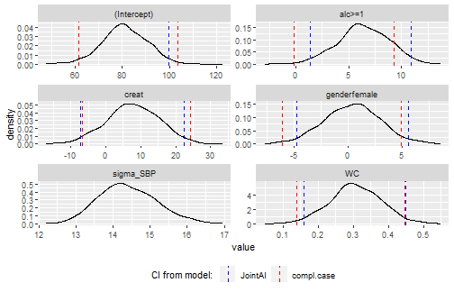
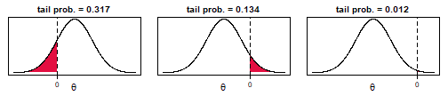
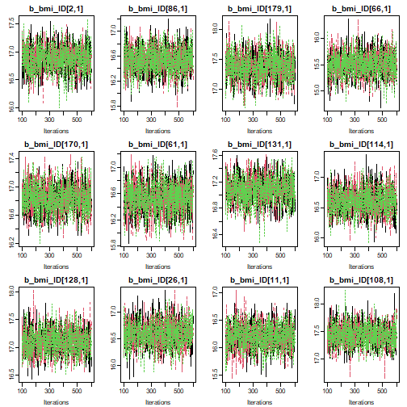
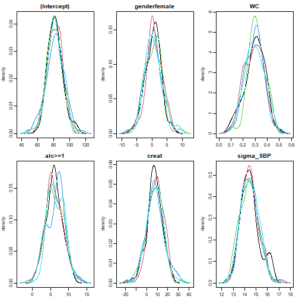
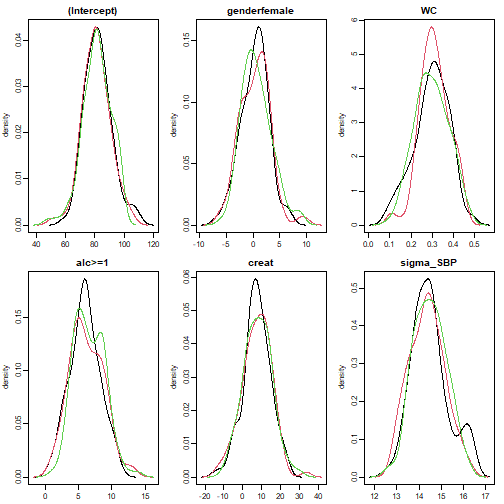
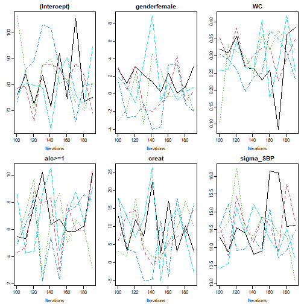
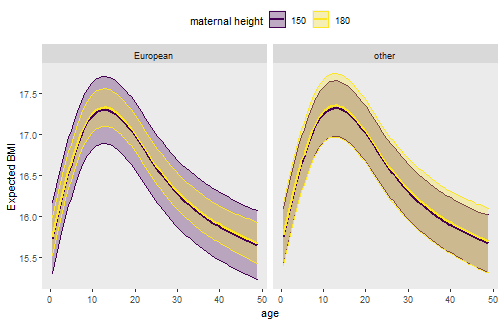

This vignette describes how the results from a `JointAI` model can be visualized,
summarized and evaluated.
We use the [NHANES](https://nerler.github.io/JointAI/reference/NHANES.html)
data for examples in cross-sectional data and the
dataset [simLong](https://nerler.github.io/JointAI/reference/simLong.html) for
examples in longitudinal data.
For more info on these datasets, check out the vignette
[*Visualizing Incomplete Data*](https://nerler.github.io/JointAI/articles/VisualizingIncompleteData.html),
in which the distributions of variables and missing values in both sets is
explored.


The functions described in this section use, by default, the full MCMC sample
and show only the parameters of the analysis model.
A number of arguments are available to select a subset of the MCMC
samples that is used to calculate the summary.
The argument `subset` allows controlling
which part of the MCMC sample is returned and follows the same logic as
the argument [`monitor_params`](https://nerler.github.io/JointAI/articles/SelectingParameters.html) in [`*_imp()`](https://nerler.github.io/JointAI/reference/model_imp.html).
The use of these arguments is further explained [below](#sec:subset).

## Visualizing the posterior sample
The posterior sample can be visualized by two commonly used plots: a
trace plot, showing samples across iterations, or a plot of the empirical
density of the posterior sample.


### Trace plot
A trace plot shows the sampled values per chain and node throughout
iterations. It allows us to evaluate convergence and mixing of the chains
visually, and can be obtained with the function
[`traceplot()`](https://nerler.github.io/JointAI/reference/traceplot.html):

```r
mod13a <- lm_imp(SBP ~ gender + WC + alc + creat, data = NHANES, n.iter = 500,
                 seed = 2020)

traceplot(mod13a)
```




When the sampler has converged the chains show one horizontal band, as in the above figure.
Consequently, when traces show a trend convergence has not been
reached and more iterations are necessary (e.g., using [`add_samples()`](https://nerler.github.io/JointAI/reference/add_samples.html)).

Graphical aspects of the traceplot can be controlled by specifying
standard graphical arguments via the dots argument `"..."`, which are passed to [`matplot()`](https://stat.ethz.ch/R-manual/R-devel/library/graphics/html/matplot.html).
This allows changing colour, line type and -width, limits, and so forth.
Arguments `nrow` and/or `ncol` can be supplied to set specific numbers of
rows and columns for the layout of the grid of plots.

With the argument `use_ggplot` it is possible to get a [**ggplot2**](https://CRAN.R-project.org/package=ggplot2)
version of the traceplot. It can be extended using standard **ggplot2** syntax.

```r
library(ggplot2)
traceplot(mod13a, ncol = 3, use_ggplot = TRUE) +
  theme(legend.position = 'bottom') +
  scale_color_brewer(palette = 'Dark2')
```




### Density plot
The posterior distributions can also be visualized using the function
[`densplot()`](https://nerler.github.io/JointAI/reference/densplot.html),
which plots the empirical density per node per chain, or combining chains
(when `joined = TRUE`).


The argument `vlines` takes a list of lists, containing specifications passed
to `abline`, and allows us to add (vertical) lines to the plot, e.g., marking zero:

```r
densplot(mod13a, ncol = 3, col = c("darkred", "darkblue", "darkgreen"),
         vlines = list(list(v = c(rep(0, length(coef(mod13a)$SBP)), NA),
                            col = grey(0.8))))
```


or marking the posterior mean and 2.5% and 97.5% quantiles:

```r
res <- rbind(summary(mod13a)$res$SBP$regcoef[, c('Mean', '2.5%', '97.5%')],
             summary(mod13a)$res$SBP$sigma[, c('Mean', '2.5%', '97.5%')])

densplot(mod13a, ncol = 3,
         vlines = list(list(v = res[, 'Mean'], lty = 1,
                            lwd = 2),
                       list(v = res[, "2.5%"], lty = 2),
                       list(v = res[, "97.5%"], lty = 2)
         )
)
```




Like with `traceplot()` it is possible to use the **ggplot2** version of `densplot()`
when setting `use_ggplot = TRUE`. Here, vertical lines can be added as additional
layers:

```r
# fit the complete-case version of the model
mod13a_cc <- lm(formula(mod13a), data = NHANES, na.action = na.omit)


# make a dataset containing the quantiles of the posterior sample and
# confidence intervals from the complete case analysis:
quantDF <- rbind(data.frame(variable = rownames(summary(mod13a)$res$SBP$regcoef),
                            type = '2.5%',
                            model = 'JointAI',
                            value = summary(mod13a)$res$SBP$regcoef[, c('2.5%')]
                            ),
                 data.frame(variable = rownames(summary(mod13a)$res$SBP$regcoef),
                            type = '97.5%',
                            model = 'JointAI',
                            value = summary(mod13a)$res$SBP$regcoef[, c('97.5%')]
                 ),
                 data.frame(variable = names(coef(mod13a_cc)),
                            type = '2.5%',
                            model = 'cc',
                            value = confint(mod13a_cc)[, '2.5 %']
                 ),
                 data.frame(variable = names(coef(mod13a_cc)),
                            type = '97.5%',
                            model = 'cc',
                            value = confint(mod13a_cc)[, '97.5 %']
                 )
)


# ggplot version:
p13a <- densplot(mod13a, use_ggplot = TRUE, joined = TRUE) +
  theme(legend.position = 'bottom')


# add vertical lines for the:
# - confidence intervals from the complete case analysis
# - quantiles of the posterior distribution
p13a +
  geom_vline(data = quantDF, aes(xintercept = value, color = model),
             lty = 2) +
  scale_color_manual(name = 'CI from model: ',
                     limits = c('JointAI', 'cc'),
                     values = c('blue', 'red'),
                     labels = c('JointAI', 'compl.case'))
```




## Model Summary
A summary of the posterior distribution estimated in a `JointAI` model can be
obtained using the function `summary()`.

The posterior summary consists of the mean, standard deviation and
quantiles (by default, the 2.5% and 97.5% quantiles) of the MCMC samples from all
chains combined. Moreover, the tail probability (see below), Gelman-Rubin
criterion (see [section below](#sec:grcrit)) and the ratio of the Monte Carlo
error to the posterior standard deviation (see [section below](#sec:mcerror))
are given.

Additionally, some essential characteristics of the MCMC samples on which the
summary is based is given. This includes the range and number of iterations
("Sample size per chain"), thinning interval, and number of chains.
Furthermore, the number of observations (number of rows in the data) is given.


```r
summary(mod13a)
#> 
#> Bayesian linear model fitted with JointAI
#> 
#> Call:
#> lm_imp(formula = SBP ~ gender + WC + alc + creat, data = NHANES, 
#>     n.iter = 500, seed = 2020)
#> 
#> 
#> Posterior summary:
#>                Mean     SD   2.5%   97.5% tail-prob. GR-crit MCE/SD
#> (Intercept)  81.550 10.084 61.559 101.577    0.00000    1.00 0.0255
#> genderfemale  0.377  2.567 -4.576   5.328    0.86667    1.00 0.0258
#> WC            0.304  0.075  0.152   0.447    0.00000    1.00 0.0258
#> alc>=1        6.298  2.392  1.601  10.743    0.00667    1.02 0.0309
#> creat         7.451  7.713 -7.000  21.888    0.34133    1.00 0.0307
#> 
#> Posterior summary of residual std. deviation:
#>           Mean    SD 2.5% 97.5% GR-crit MCE/SD
#> sigma_SBP 14.4 0.755 13.1    16       1 0.0279
#> 
#> 
#> MCMC settings:
#> Iterations = 101:600
#> Sample size per chain = 500 
#> Thinning interval = 1 
#> Number of chains = 3 
#> 
#> Number of observations: 186
```

For mixed models, `summary()` also returns the posterior summary of the
random effects covariance matrix `D` and the number of groups. The argument
`missinfo = TRUE` will add information on the missing values in the variables
involved in the model:

```r
library(splines)
mod13b <- lme_imp(bmi ~ GESTBIR + ETHN + HEIGHT_M + ns(age, df = 3),
                  random = ~ 1 | ID,
                  data = subset(simLong, !is.na(bmi)),
                  n.iter = 500, no_model = 'age', seed = 2020)
```

```r
summary(mod13b, missinfo = TRUE)
#> 
#> Bayesian linear mixed model fitted with JointAI
#> 
#> Call:
#> lme_imp(fixed = bmi ~ GESTBIR + ETHN + HEIGHT_M + ns(age, df = 3), 
#>     data = subset(simLong, !is.na(bmi)), random = ~1 | ID, n.iter = 500, 
#>     no_model = "age", seed = 2020)
#> 
#> 
#> Posterior summary:
#>                      Mean      SD    2.5%   97.5% tail-prob. GR-crit MCE/SD
#> (Intercept)      17.69623 2.41136 12.9250 22.4174    0.00000    1.00 0.0285
#> GESTBIR          -0.05154 0.04741 -0.1468  0.0406    0.27200    1.01 0.0264
#> ETHNother         0.01861 0.15346 -0.2821  0.3164    0.90133    1.01 0.0320
#> HEIGHT_M          0.00072 0.00959 -0.0179  0.0196    0.94400    1.01 0.0288
#> ns(age, df = 3)1 -0.23948 0.07651 -0.3907 -0.0885    0.00267    1.01 0.0258
#> ns(age, df = 3)2  1.93595 0.11370  1.7147  2.1529    0.00000    1.01 0.0258
#> ns(age, df = 3)3 -1.25001 0.05938 -1.3668 -1.1291    0.00000    1.00 0.0258
#> 
#> Posterior summary of random effects covariance matrix:
#>                Mean     SD  2.5% 97.5% tail-prob. GR-crit MCE/SD
#> D_bmi_ID[1,1] 0.701 0.0775 0.566 0.867                  1 0.0294
#> 
#> Posterior summary of residual std. deviation:
#>            Mean     SD  2.5% 97.5% GR-crit MCE/SD
#> sigma_bmi 0.684 0.0117 0.661 0.708       1 0.0278
#> 
#> 
#> MCMC settings:
#> Iterations = 101:600
#> Sample size per chain = 500 
#> Thinning interval = 1 
#> Number of chains = 3 
#> 
#> Number of observations: 1881 
#> Number of groups:
#>  - ID: 200
#> 
#> 
#> Number and proportion of complete cases:
#>         level    #   %
#> ID         ID  190  95
#> lvlone lvlone 1881 100
#> 
#> Number and proportion of missing values:
#>      level # NA % NA
#> bmi lvlone    0    0
#> age lvlone    0    0
#> 
#>          level # NA % NA
#> GESTBIR     ID    0    0
#> ID          ID    0    0
#> HEIGHT_M    ID    4    2
#> ETHN        ID    6    3
```

At the end of the summary output, a summary of the number and proportion
of missing values per variable is printed

### Tail probability
The tail probability, calculated as
$2\times\min\left\{Pr(\theta > 0), Pr(\theta < 0)\right\},$
where $\theta$ is the parameter of interest,
is a measure of how likely the value 0 is under the
estimated posterior distribution.
The figure visualizes three examples of posterior distributions
and the corresponding minimum of $Pr(\theta > 0)$ and $Pr(\theta < 0)$
(shaded area):



## Evaluation criteria
The convergence of the MCMC chains and precision of the posterior sample can also
be evaluated more formally. Implemented in **JointAI** are
the Gelman-Rubin criterion for convergence^[Gelman, A. and Rubin, D.B. (1992).
Inference from Iterative Simulation Using Multiple Sequences.
*Statistical Science* **7**(4), 457-472. doi: 10.1214/ss/1177011136.
<br><br>
Brooks, S. P. and Gelman, A. (1998).
General Methods for Monitoring Convergence of Iterative Simulations.
*Journal of Computational and Graphical Statistics*
**7**(4), 434 - 455. doi: 10.1080/10618600.1998.10474787.]
and a comparison of the Monte Carlo Error with the posterior standard deviation.

### Gelman-Rubin criterion for convergence {#sec:grcrit}
The Gelman-Rubin criterion evaluates convergence by comparing
within and between chain variability and, thus, requires at least two MCMC chains
to be calculated.
It is implemented for `JointAI` objects in the function
[`GR_crit()`](https://nerler.github.io/JointAI/reference/GR_crit.html),
which is based on the function `gelman.diag()` from the package
[**coda**](https://CRAN.R-project.org/package=coda).
The upper limit of the confidence interval should not be much larger than 1.

```r
GR_crit(mod13a)
#> Potential scale reduction factors:
#> 
#>              Point est. Upper C.I.
#> (Intercept)       1.000       1.00
#> genderfemale      1.000       1.00
#> WC                0.999       1.00
#> alc>=1            1.011       1.04
#> creat             1.004       1.01
#> sigma_SBP         1.001       1.01
#> 
#> Multivariate psrf
#> 
#> 1.01
```

Besides the arguments `start`, `end`, `thin`, and `subset`, which are explained
[below](#sec:subset), `GR_crit()` also takes the arguments of `gelman.diag()`.


### Monte Carlo Error {#sec:mcerror}
The precision of the MCMC sample can be checked with the function
[`MC_error()`](https://nerler.github.io/JointAI/reference/MC_error.html).
It uses the function `mcmcse::mcmcse.mat()` from the package [**mcmcse**](https://CRAN.R-project.org/package=mcmcse)
to calculate the Monte Carlo error (the error that is made since the sample
is finite) and compares it to the standard deviation of the posterior sample.
A rule of thumb is that the Monte Carlo error should not be more than 5% of the
standard deviation^[Lesaffre, E. M. and A. B. Lawson (2012).
*Bayesian Biostatistics*. John Wiley & Sons. doi: 10.1002/9781119942412.].
Besides the arguments explained [below](#sec:subset), `MC_error()`
takes the arguments of `mcmcse.mat()`.

```r
MC_error(mod13a)
#>                est   MCSE     SD MCSE/SD
#> (Intercept)  81.55 0.2573 10.084   0.026
#> genderfemale  0.38 0.0663  2.567   0.026
#> WC            0.30 0.0019  0.075   0.026
#> alc>=1        6.30 0.0738  2.392   0.031
#> creat         7.45 0.2370  7.713   0.031
#> sigma_SBP    14.41 0.0211  0.755   0.028
```

`MC_error()` returns an object of class `MCElist`, which is a list containing
matrices with the posterior mean,
estimated Monte Carlo error, posterior standard deviation and the ratio of the
Monte Carlo error to the posterior standard deviation, for the scaled (if they
are part of the `JointAI` object) and unscaled
(transformed back to the scale of the data) posterior samples.
The associated print method prints only the latter.

To facilitate quick evaluation of the Monte Carlo error to posterior standard
deviation ratio, plotting of an object of class `MCElist` using `plot()` shows
this ratio for each (selected) node and automatically adds a vertical line at
the desired cut-off (by default 5%).

```r
par(mar = c(3, 5, 0.5, 0.5), mgp = c(2, 0.6, 0), mfrow = c(1, 2))
plot(MC_error(mod13a))  # left panel: all iterations 101:600
plot(MC_error(mod13a, end = 250))  # right panel: iterations 101:250
```


## Subset of output {#sec:subset}
By default, the functions `traceplot()`, `densplot()`, `summary()`,
`GR_crit()`, `MC_Error()` and `predict()`
use all iterations of the MCMC sample and consider
only the parameters of the analysis model (if they were monitored).
In this section, we describe how the
set of iterations and parameters to display can be changed using the
arguments `subset`, `start`, `end`, `thin` and `exclude_chains`.

### Subset of parameters
As long as the main parameters have been monitored in a `JointAI` object, only
these parameters are returned in the model summary, plots and criteria shown
above. When the main parameters of the analysis model were not monitored, i.e.,
`monitor_params = c(analysis_main = FALSE)`, and the argument `subset` is not
specified, all parameters that were monitored are displayed.

To display output for nodes other than the main parameters of the analysis model
or for a subset of nodes, the argument `subset` needs to be specified.

#### Examples
To display only the parameters of the imputation models, we set `subset =
c(analysis_main = FALSE, other_models = TRUE)` (after re-estimating the model
with the monitor for these parameters switched on):

```r
mod13c <- update(mod13a, monitor_params = c(other_models = TRUE))
```

```r
summary(mod13c, subset = c(analysis_main = FALSE, other_models = TRUE))
#> 
#> Bayesian joint model fitted with JointAI 
#> 
#> Call:
#> lm_imp(formula = SBP ~ gender + WC + alc + creat, data = NHANES, 
#>     n.iter = 500, monitor_params = c(other_models = TRUE), seed = 2020)
#> 
#> 
#> # --------------------------------------------------------------------- #
#>   Bayesian binomial model for "alc"
#> # - - - - - - - - - - - - - - - - - - - - - - - - - - - - - - - - - - - #
#> 
#> Posterior summary:
#>                  Mean     SD    2.5%   97.5% tail-prob. GR-crit MCE/SD
#> (Intercept)   0.45047 1.6388 -2.6234  3.6352     0.8027    1.02 0.0804
#> genderfemale -0.88047 0.4280 -1.7266 -0.0523     0.0453    1.07 0.0997
#> WC            0.00683 0.0116 -0.0168  0.0286     0.5480    1.00 0.0388
#> creat        -1.47351 1.2420 -3.9374  0.9389     0.2360    1.02 0.0741
#> 
#> 
#> # --------------------------------------------------------------------- #
#>   Bayesian linear model for "creat"
#> # - - - - - - - - - - - - - - - - - - - - - - - - - - - - - - - - - - - #
#> 
#> Posterior summary:
#>                   Mean      SD      2.5%    97.5% tail-prob. GR-crit MCE/SD
#> (Intercept)   0.842494 0.07482  0.695583  0.98859      0.000   1.003 0.0267
#> genderfemale -0.177470 0.02284 -0.222692 -0.13586      0.000   0.999 0.0267
#> WC            0.000894 0.00075 -0.000618  0.00236      0.231   1.005 0.0269
#> 
#> Posterior summary of residual std. deviation:
#>              Mean      SD  2.5% 97.5% GR-crit MCE/SD
#> sigma_creat 0.146 0.00775 0.131 0.162       1 0.0286
#> 
#> 
#> # --------------------------------------------------------------------- #
#>   Bayesian linear model for "WC"
#> # - - - - - - - - - - - - - - - - - - - - - - - - - - - - - - - - - - - #
#> 
#> Posterior summary:
#>               Mean   SD  2.5%  97.5% tail-prob. GR-crit MCE/SD
#> (Intercept)  97.52 1.45 94.77 100.42     0.0000    1.02 0.0258
#> genderfemale -5.25 2.11 -9.35  -1.16     0.0133    1.00 0.0255
#> 
#> Posterior summary of residual std. deviation:
#>          Mean    SD 2.5% 97.5% GR-crit MCE/SD
#> sigma_WC 14.5 0.777   13  16.1       1 0.0269
#> 
#> 
#> # ----------------------------------------------------------- #
#> 
#> MCMC settings:
#> Iterations = 101:600
#> Sample size per chain = 500 
#> Thinning interval = 1 
#> Number of chains = 3 
#> 
#> Number of observations: 186
```

To select only some of the parameters, they can be specified directly by
name via the `other` element of `subset`.

```r
densplot(mod13c, subset = list(analysis_main = FALSE,
                               other = c('beta[4]', 'beta[5]')), nrow = 1)
```


This also works when a subset of the imputed values should be displayed:

```r
# re-fit the model and monitor the imputed values
mod13d <- update(mod13a, monitor_params = c(imps = TRUE))
```

```r
# select all imputed values for 'WC' (4th column of M_lvlone)
sub3 <- grep('M_lvlone\\[[[:digit:]]+,4\\]', parameters(mod13d)$coef, value = TRUE)
sub3
#> [1] "M_lvlone[33,4]"  "M_lvlone[150,4]"

# pass "sub3" to "subset" via "other", for example in a traceplot:
traceplot(mod13d, subset = list(analysis_main = FALSE, other = sub3), ncol = 2)
```


When the number of imputed values is large or in order to check convergence
of random effects, it may not be feasible to plot and inspect all trace plots.
In that case a random subset of, for instance the random effects, can be selected
(output not shown):

```r
# re-fit the model monitoring the random effects
mod13e <- update(mod13b, monitor_params = c(ranef_main = TRUE))
```

```r
# extract random intercepts
ri <- grep('^b_bmi_ID\\[[[:digit:]]+,1\\]$', colnames(mod13e$MCMC[[1]]), value = T)

# to plot the chains of 12 randomly selected random intercepts and slopes:
traceplot(mod13e, subset = list(analysis_main = FALSE,
                                other = sample(ri, size = 12)), ncol = 4)
```




### Subset of MCMC samples
With the arguments `start`, `end` and `thin` it is possible to
select which iterations from the MCMC sample are included in the summary.
`start` and `end` specify the first and last iterations to be used,
`thin` the thinning interval. Specification of `start`, thus, allows discarding
a "burn-in", i.e., the iterations before the MCMC chain had converged.

If a particular chain does not have converged it can be excluded from the
summary or plot using the argument `exclude_chains`. This argument takes a
numeric vector identifying chains to be excluded, for example:


```r
mod14 <- lm_imp(SBP ~ gender + WC + alc + creat, data = NHANES, n.iter = 100,
                progress.bar = 'none', n.chains = 5)

densplot(mod14, ncol = 3)
```



```r
densplot(mod14, exclude_chains = c(2,4), ncol = 3)
```




```r
traceplot(mod14, thin = 10, ncol = 3)
```



```r
traceplot(mod14, start = 150, ncol = 3)
```


```r
traceplot(mod14, end = 120, ncol = 3)
```


## Predicted values
Often, the aim of an analysis is not only to estimate the association between outcome
and covariates but to predict future outcomes or outcomes for new subjects.

The function [`predict()`](https://nerler.github.io/JointAI/reference/predict.JointAI.html)
allows us to obtain predicted values and corresponding
credible intervals from `JointAI` objects. Note that for mixed
models, currently, only marginal prediction but not prediction conditional on
the random effects is implemented.

A dataset containing data which the prediction should be performed is specified
via the argument `newdata`. If no `newdata` is given, the original data from the
JointAI object are used.
The argument `quantiles` allows the specification of the
quantiles of the posterior sample that are used to obtain the credible interval
(by default the 2.5% and 97.5% quantile).
Arguments `start`, `end`, `thin` and `exclude_chains` control the subset of MCMC samples that is used.


```r
predict(mod13a, newdata = NHANES[27, ])
#> $newdata
#>          SBP gender age             race   WC alc educ creat albu
#> 392 126.6667   male  32 Mexican American 94.1  <1  low  0.83  4.2
#>     uricacid bili occup  smoke      fit     2.5%    97.5%
#> 392      8.7    1  <NA> former 116.3687 112.6749 120.4215
#> 
#> $fitted
#>        fit     2.5%    97.5%
#> 1 116.3687 112.6749 120.4215
```

`predict()` returns a list with elements `dat`, `fit` and `quantiles`,
containing `newdata` with the predicted values and quantiles appended,
the predicted values and quantiles that form the credible interval.

### Prediction to visualize non-linear effects
Another reason to obtain predicted values is the visualization of non-linear
effects, i.e., to create an effect plot.
To facilitate the generation of a dataset for such a prediction,
the function [`predDF()`](https://nerler.github.io/JointAI/reference/predDF.html)
can be used. It generates a `data.frame`
that contains a sequence of values through the range of observed values for a
covariate specified by the argument `vars`, and the median or reference value for
all other continuous and categorical variables.


```r
# create dataset for prediction
newDF <- predDF(mod13b, var = ~ age)

# obtain predicted values
pred <- predict(mod13b, newdata = newDF)
#> Warning: 
#> Prediction in multi-level settings currently only takes into
#> account the fixed effects, i.e., assumes that the random
#> effect realizations are equal to zero.

# plot predicted values and credible interval
matplot(pred$newdata$age, pred$fitted,
        lty = c(1,2,2), type = 'l', col = 1,
        xlab = 'age in months', ylab = 'predicted value')
```


It is possible to have multiple variables vary and to set values for these
variables:


```r
# create dataset for prediction
newDF <- predDF(mod13b, var = ~ age + HEIGHT_M + ETHN, HEIGHT_M = c(150, 180))

# obtain predicted values
pred <- predict(mod13b, newdata = newDF)
#> Warning: 
#> Prediction in multi-level settings currently only takes into
#> account the fixed effects, i.e., assumes that the random
#> effect realizations are equal to zero.


# plot predicted values and credible interval
library(ggplot2)
ggplot(pred$newdata, aes(x = age, y = fit, color = factor(HEIGHT_M),
                         fill = factor(HEIGHT_M))) +
  geom_ribbon(aes(ymin = `2.5%`, ymax = `97.5%`), alpha = 0.3) +
  geom_line(size = 1) +
  facet_wrap('ETHN') +
  theme(legend.position = 'top',
        panel.grid = element_blank()) +
  scale_fill_viridis_d(name = 'maternal height',
                       aesthetics = c('colour', 'fill')) +
  scale_y_continuous(name = 'Expected BMI', breaks = seq(15, 18, 0.5))
```




## Export of imputed values
Imputed datasets can be extracted from a `JointAI` object (in which a monitor for
the imputed values has been set, i.e., `monitor_params = c(imps = TRUE)`),
with the function [`get_MIdat()`](https://nerler.github.io/JointAI/reference/get_MIdat.html).

A completed dataset is created by taking the imputed values from a randomly
chosen iteration of the MCMC sample, transforming them back to the original scale
if scaling had been performed before the MCMC sampling,
and filling them into the original incomplete data.

The argument `m` specifies the number of imputed datasets to be created,
`include` controls whether the original data are included in the long format
`data.frame` (default is `include = TRUE`),
`start` specifies the first iteration that may be used and `minspace` is
the minimum number of iterations between iterations eligible to be selected.

To make the selection of iterations to form the imputed data reproducible, a
seed value can be specified via the argument `seed`.

When `export_to_SPSS = TRUE` the imputed data is exported to SPSS, i.e.,
a `.txt` file containing the data and a `.sps` file containing SPSS syntax to
convert the data into an SPSS data file (with ending `.sav`) are written.
Arguments `filename` and `resdir` allow the specification of the name of the `.txt` and
`.sps` file and the directory they are written to.

`get_MIdat()` returns a long-format `data.frame` containing the imputed datasets
(and by default the original data) stacked onto each other. The imputation number
is given in the variable `Imputation_`, column `.id` contains a newly created
id variable for each observation in cross-sectional data (multi-level data should
already contain an id variable).


```r
impDF <- get_MIdat(mod13d, m = 10, seed = 2018)
```

The function `plot_imp_distr()` allows us to visually compare the distribution
of the observed and imputed values.

```r
plot_imp_distr(impDF, nrow = 1)
```


