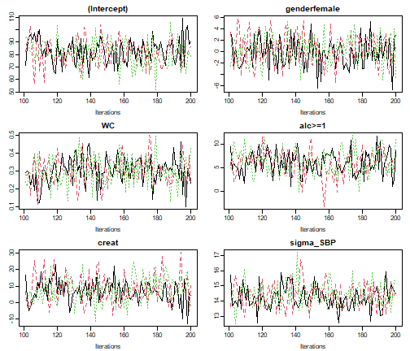
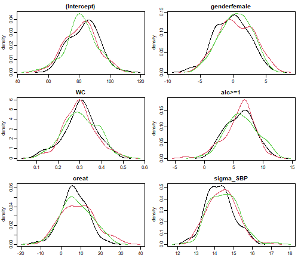
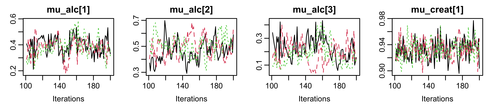
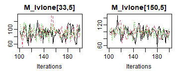
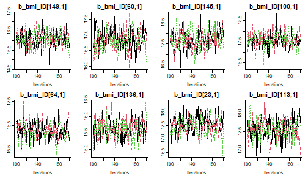
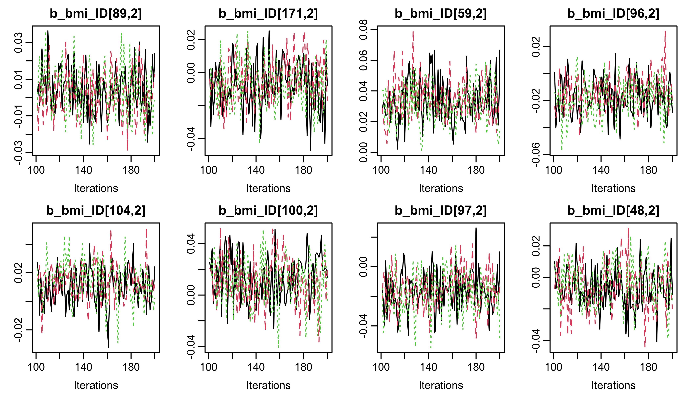

In this vignette, we use the [NHANES](https://nerler.github.io/JointAI/reference/NHANES.html)
data for examples in cross-sectional data and the
dataset [simLong](https://nerler.github.io/JointAI/reference/simLong.html) for
examples in longitudinal data.
For more info on these datasets, check out the vignette
[*Visualizing Incomplete Data*](https://nerler.github.io/JointAI/articles/VisualizingIncompleteData.html),
in which the distribution of variables and missing values in both sets is
explored.

**Note:**<br>
In several of the examples we use `n.adapt = 0`
(and `n.iter = 0`, which is the default) in order to prevent the MCMC sampling
to reduce computational some time.
`progress.bar = 'none'` prevents printing of the progress of the MCMC
sampling, which results in lengthy output in the vignette, but is useful in
practice.


## Monitoring parameters
**JointAI** uses [JAGS](http://mcmc-jags.sourceforge.net/)
for performing the MCMC ([Markov Chain Monte Carlo](https://en.wikipedia.org/wiki/Markov_chain_Monte_Carlo)) sampling.
Since JAGS only saves the values of MCMC chains for those parameters/variables for
which the user has specified that they should be monitored, this is also the
case in **JointAI**.

For this purpose, the main functions
[`*_imp()`](https://nerler.github.io/JointAI/reference/model_imp.html)
have an argument `monitor_params`.

`monitor_params` takes a named list (often a named vector also works) with
the following possible entries:

<table>
 <thead>
  <tr>
   <th style="text-align:left;"> name/key word </th>
   <th style="text-align:left;"> what is monitored </th>
  </tr>
 </thead>
<tbody>
  <tr>
   <td style="text-align:left;"> `analysis_main` </td>
   <td style="text-align:left;"> `betas` and `sigma_main`, `tau_main` (in beta regression) or `shape_main` (in parametric survival models), `D_main` (in multi-level models) and `basehaz` (in proportional hazards models) </td>
  </tr>
  <tr>
   <td style="text-align:left;"> `analysis_random` </td>
   <td style="text-align:left;"> `ranef_main`, `D_main`, `invD_main`, `RinvD_main` </td>
  </tr>
  <tr>
   <td style="text-align:left;"> `other_models` </td>
   <td style="text-align:left;"> `alphas`, `tau_other`, `gamma_other`, `delta_other` </td>
  </tr>
  <tr>
   <td style="text-align:left;"> `imps` </td>
   <td style="text-align:left;"> imputed values </td>
  </tr>
  <tr>
   <td style="text-align:left;"> `betas` </td>
   <td style="text-align:left;"> regression coefficients of the main analysis model(s) </td>
  </tr>
  <tr>
   <td style="text-align:left;"> `tau_main` </td>
   <td style="text-align:left;"> precision of the residuals from the analysis model(s) </td>
  </tr>
  <tr>
   <td style="text-align:left;"> `sigma_main` </td>
   <td style="text-align:left;"> standard deviation of the residuals from the analysis model(s) </td>
  </tr>
  <tr>
   <td style="text-align:left;"> `gamma_main` </td>
   <td style="text-align:left;"> intercepts in ordinal main model </td>
  </tr>
  <tr>
   <td style="text-align:left;"> `delta_main` </td>
   <td style="text-align:left;"> increments of ordinal intercepts in main model(s) </td>
  </tr>
  <tr>
   <td style="text-align:left;"> `ranef_main` </td>
   <td style="text-align:left;"> random effects of the analysis model(s) </td>
  </tr>
  <tr>
   <td style="text-align:left;"> `D_main` </td>
   <td style="text-align:left;"> covariance matrix of the random effects of the main model(s) </td>
  </tr>
  <tr>
   <td style="text-align:left;"> `invD_main` </td>
   <td style="text-align:left;"> inverse of `D_main` </td>
  </tr>
  <tr>
   <td style="text-align:left;"> `RinvD_main` </td>
   <td style="text-align:left;"> scale matrix in Wishart prior for `invD_main` </td>
  </tr>
  <tr>
   <td style="text-align:left;"> `alphas` </td>
   <td style="text-align:left;"> regression coefficients in the covariate models </td>
  </tr>
  <tr>
   <td style="text-align:left;"> `tau_other` </td>
   <td style="text-align:left;"> precision parameters of the residuals from covariate models </td>
  </tr>
  <tr>
   <td style="text-align:left;"> `gamma_other` </td>
   <td style="text-align:left;"> intercepts in ordinal covariate models </td>
  </tr>
  <tr>
   <td style="text-align:left;"> `delta_other` </td>
   <td style="text-align:left;"> increments of ordinal intercepts in covariate models </td>
  </tr>
  <tr>
   <td style="text-align:left;"> `ranef_other` </td>
   <td style="text-align:left;"> random effects of the covariate model(s) </td>
  </tr>
  <tr>
   <td style="text-align:left;"> `D_other` </td>
   <td style="text-align:left;"> covariance matrix of the random effects of the covariate model(s) </td>
  </tr>
  <tr>
   <td style="text-align:left;"> `invD_other` </td>
   <td style="text-align:left;"> inverse of `D_other` </td>
  </tr>
  <tr>
   <td style="text-align:left;"> `RinvD_other` </td>
   <td style="text-align:left;"> scale matrix in Wishart prior for `invD_other` </td>
  </tr>
  <tr>
   <td style="text-align:left;"> `other` </td>
   <td style="text-align:left;"> additional parameters </td>
  </tr>
</tbody>
</table>

Each of the key words works as a switch, except for `other`, which should be
a vector of character strings.

### Parameters of the analysis model
The default setting is `monitor_params = c(analysis_main = TRUE)`, i.e.,
only the main parameters of the analysis model are monitored, and
monitoring is switched off for all other parameters.

The main parameters are the regression coefficients of the analysis model
(`beta`) and potentially the residual standard deviation,
for example in linear or Gamma models, the second parameter in
a beta distribution (parametrized with $\mu$  and $\tau$ instead of two shape
parameters), the variance-covariance matrices of random effects used in the main
models, the shape parameter in a parametric Weibull survival model, and the
coefficients used in the spline specification of the baseline
hazard of proportional hazards survival models.

The function `parameters()` returns the parameters that are specified to be
followed (even for models where no MCMC sampling was performed, i.e. when
`n.iter = 0` and `n.adapt = 0`).

For example:

```r
lm1 <- lm_imp(SBP ~ gender + WC + alc + creat, data = NHANES,  n.adapt = 0)

parameters(lm1)
#>   outcome outcat      varname      coef
#> 1     SBP   <NA>  (Intercept)   beta[1]
#> 2     SBP   <NA> genderfemale   beta[2]
#> 3     SBP   <NA>           WC   beta[3]
#> 4     SBP   <NA>       alc>=1   beta[4]
#> 5     SBP   <NA>        creat   beta[5]
#> 6     SBP   <NA>         <NA> sigma_SBP
```

The column `outcome` refers to the response variable of a particular model,
to distinguish between the regression coefficients in different sub-models,
and the column `outcat` will contain the category of the response variable that
a particular linear predictor corresponds to in multinomial logit models.

### Imputed values & parameters of the imputation models
To generate (multiple) imputed datasets that can be used for further analyses,
the imputed values need to be monitored. This can be done by setting
`monitor_params = c(imps = TRUE)`.


```r
lm2 <- lm_imp(SBP ~ age + WC + alc + smoke + occup,
              data = NHANES, n.adapt = 0,
              monitor_params = c(imps = TRUE, analysis_main = FALSE)
)

parameters(lm2)
#>    outcat varname            coef outcome
#> 1      NA      NA   M_lvlone[1,2]      NA
#> 2      NA      NA   M_lvlone[7,2]      NA
#> 3      NA      NA   M_lvlone[8,2]      NA
#> 4      NA      NA  M_lvlone[12,2]      NA
#> 5      NA      NA  M_lvlone[13,2]      NA
#> 6      NA      NA  M_lvlone[21,2]      NA
#> 7      NA      NA  M_lvlone[22,2]      NA
#> 8      NA      NA  M_lvlone[31,2]      NA
#> 9      NA      NA  M_lvlone[33,2]      NA
#> 10     NA      NA  M_lvlone[34,2]      NA
#> 11     NA      NA  M_lvlone[39,2]      NA
#> 12     NA      NA  M_lvlone[49,2]      NA
#> 13     NA      NA  M_lvlone[66,2]      NA
#> 14     NA      NA  M_lvlone[67,2]      NA
#> 15     NA      NA  M_lvlone[80,2]      NA
#> 16     NA      NA  M_lvlone[86,2]      NA
#> 17     NA      NA  M_lvlone[91,2]      NA
#> 18     NA      NA  M_lvlone[92,2]      NA
#> 19     NA      NA M_lvlone[105,2]      NA
#> 20     NA      NA M_lvlone[111,2]      NA
#> 21     NA      NA M_lvlone[115,2]      NA
#> 22     NA      NA M_lvlone[118,2]      NA
#> 23     NA      NA M_lvlone[120,2]      NA
#> 24     NA      NA M_lvlone[127,2]      NA
#> 25     NA      NA M_lvlone[132,2]      NA
#> 26     NA      NA M_lvlone[139,2]      NA
#> 27     NA      NA M_lvlone[146,2]      NA
#> 28     NA      NA M_lvlone[149,2]      NA
#> 29     NA      NA M_lvlone[152,2]      NA
#> 30     NA      NA M_lvlone[163,2]      NA
#> 31     NA      NA M_lvlone[165,2]      NA
#> 32     NA      NA M_lvlone[169,2]      NA
#> 33     NA      NA M_lvlone[180,2]      NA
#> 34     NA      NA M_lvlone[185,2]      NA
#> 35     NA      NA   M_lvlone[6,3]      NA
#> 36     NA      NA  M_lvlone[16,3]      NA
#> 37     NA      NA  M_lvlone[24,3]      NA
#> 38     NA      NA  M_lvlone[27,3]      NA
#> 39     NA      NA  M_lvlone[45,3]      NA
#> 40     NA      NA  M_lvlone[57,3]      NA
#> 41     NA      NA  M_lvlone[58,3]      NA
#> 42     NA      NA  M_lvlone[60,3]      NA
#> 43     NA      NA  M_lvlone[61,3]      NA
#> 44     NA      NA  M_lvlone[65,3]      NA
#> 45     NA      NA  M_lvlone[66,3]      NA
#> 46     NA      NA  M_lvlone[70,3]      NA
#> 47     NA      NA  M_lvlone[80,3]      NA
#> 48     NA      NA  M_lvlone[81,3]      NA
#> 49     NA      NA  M_lvlone[85,3]      NA
#> 50     NA      NA  M_lvlone[88,3]      NA
#> 51     NA      NA  M_lvlone[89,3]      NA
#> 52     NA      NA  M_lvlone[90,3]      NA
#> 53     NA      NA M_lvlone[101,3]      NA
#> 54     NA      NA M_lvlone[104,3]      NA
#> 55     NA      NA M_lvlone[116,3]      NA
#> 56     NA      NA M_lvlone[133,3]      NA
#> 57     NA      NA M_lvlone[137,3]      NA
#> 58     NA      NA M_lvlone[143,3]      NA
#> 59     NA      NA M_lvlone[168,3]      NA
#> 60     NA      NA M_lvlone[170,3]      NA
#> 61     NA      NA M_lvlone[180,3]      NA
#> 62     NA      NA M_lvlone[186,3]      NA
#> 63     NA      NA  M_lvlone[16,4]      NA
#> 64     NA      NA  M_lvlone[99,4]      NA
#> 65     NA      NA M_lvlone[123,4]      NA
#> 66     NA      NA M_lvlone[156,4]      NA
#> 67     NA      NA M_lvlone[158,4]      NA
#> 68     NA      NA M_lvlone[166,4]      NA
#> 69     NA      NA M_lvlone[172,4]      NA
#> 70     NA      NA  M_lvlone[33,5]      NA
#> 71     NA      NA M_lvlone[150,5]      NA
```

**JointAI** uses separate data matrices per level in the hierarchy of a
multi-level model. The lowest level (and only level for models with no
hierarchical structure) is called `lvlone`, the other levels are named based
on the corresponding grouping/id variables.

For categorical variables the original variable as well as the corresponding
dummy variables are stored in the matrices. The same is the case for interaction
terms and transformations of variables.


```r
head(lm2$data_list$M_lvlone)
#>          SBP alc occup smoke    WC (Intercept) age alc>=1 smokeformer smokecurrent
#> 10  108.0000  NA     1     1  99.0           1  35     NA          NA           NA
#> 14  105.3333   0     1     1  82.7           1  38     NA          NA           NA
#> 41  110.0000   0     3     1  94.9           1  78     NA          NA           NA
#> 77  106.0000   1     2     1  82.4           1  23     NA          NA           NA
#> 91  114.6667   0     3     1  93.1           1  40     NA          NA           NA
#> 105 139.3333   1    NA     3 105.4           1  54     NA          NA           NA
#>     occuplooking for work occupnot working
#> 10                     NA               NA
#> 14                     NA               NA
#> 41                     NA               NA
#> 77                     NA               NA
#> 91                     NA               NA
#> 105                    NA               NA
```


The parameters of the models for the incomplete variables can be selected with
`monitor_params = c(other_models = TRUE)`. This will set monitors for the
regression coefficients (`alpha`) and other parameters, such as precision
(`tau_*`) and intercepts & increments (`gamma_*` and `delta_*`) in cumulative
logit models.


```r
lm3 <- lm_imp(SBP ~ age + WC + alc + smoke + occup, data = NHANES, n.adapt = 0,
              monitor_params = c(other_models = TRUE, analysis_main = FALSE)
)

parameters(lm3)
#>    outcome                outcat               varname           coef
#> 1      alc                  <NA>           (Intercept)       alpha[1]
#> 2      alc                  <NA>                   age       alpha[2]
#> 3      alc                  <NA>                    WC       alpha[3]
#> 4      alc                  <NA>           smokeformer       alpha[4]
#> 5      alc                  <NA>          smokecurrent       alpha[5]
#> 6      alc                  <NA> occuplooking for work       alpha[6]
#> 7      alc                  <NA>      occupnot working       alpha[7]
#> 8    occup occuplooking for work           (Intercept)       alpha[8]
#> 9    occup occuplooking for work                   age       alpha[9]
#> 10   occup occuplooking for work                    WC      alpha[10]
#> 11   occup occuplooking for work           smokeformer      alpha[11]
#> 12   occup occuplooking for work          smokecurrent      alpha[12]
#> 13   occup      occupnot working           (Intercept)      alpha[13]
#> 14   occup      occupnot working                   age      alpha[14]
#> 15   occup      occupnot working                    WC      alpha[15]
#> 16   occup      occupnot working           smokeformer      alpha[16]
#> 17   occup      occupnot working          smokecurrent      alpha[17]
#> 18   smoke                  <NA>                   age      alpha[18]
#> 19   smoke                  <NA>                    WC      alpha[19]
#> 23   smoke                  <NA>                  <NA> gamma_smoke[1]
#> 24   smoke                  <NA>                  <NA> gamma_smoke[2]
#> 20      WC                  <NA>           (Intercept)      alpha[20]
#> 21      WC                  <NA>                   age      alpha[21]
#> 22      WC                  <NA>                  <NA>       sigma_WC
```

#### Side note: Getting information about of the imputation models
An overview of all models that form part of the joint model, including the
names of the parameters and the hyper-parameters can be obtained with

```r
list_models(lm2)
#> Linear model for "SBP" 
#>    family: gaussian 
#>    link: identity 
#> * Predictor variables:
#>   (Intercept), age, WC, alc>=1, smokeformer, smokecurrent, occuplooking for 
#>   work, occupnot working 
#> * Regression coefficients:
#>   beta[1:8] (normal prior(s) with mean 0 and precision 1e-04) 
#> * Precision of  "SBP" :
#>   tau_SBP (Gamma prior with shape parameter 0.01 and rate parameter 0.01)
#> 
#> 
#> Binomial model for "alc" 
#>    family: binomial 
#>    link: logit 
#> * Reference category: "<1"
#> * Predictor variables:
#>   (Intercept), age, WC, smokeformer, smokecurrent, occuplooking for work, 
#>   occupnot working 
#> * Regression coefficients:
#>   alpha[1:7] (normal prior(s) with mean 0 and precision 1e-04) 
#> 
#> 
#> Multinomial logit model for "occup" 
#> * Reference category: "working"
#> * Predictor variables:
#>   (Intercept), age, WC, smokeformer, smokecurrent 
#> * Regression coefficients:
#>   occuplooking for work: alpha[8:12]
#>   occupnot working: alpha[13:17] (normal prior(s) with mean 0 and precision 1e-04) 
#> 
#> 
#> Cumulative logit model for "smoke" 
#> * Reference category: "never"
#> * Predictor variables:
#>   age, WC 
#> * Regression coefficients:
#>   alpha[18:19] (normal prior(s) with mean 0 and precision 1e-04) 
#> * Intercepts:
#>   - never: gamma_smoke[1] (normal prior with mean 0 and precision 1e-04)
#>   - former: gamma_smoke[2] = gamma_smoke[1] + exp(delta_smoke[1])
#> * Increments:
#>   delta_smoke[1] (normal prior(s) with mean 0 and precision 1e-04)
#> 
#> 
#> Linear model for "WC" 
#>    family: gaussian 
#>    link: identity 
#> * Predictor variables:
#>   (Intercept), age 
#> * Regression coefficients:
#>   alpha[20:21] (normal prior(s) with mean 0 and precision 1e-04) 
#> * Precision of  "WC" :
#>   tau_WC (Gamma prior with shape parameter 0.01 and rate parameter 0.01)
```

#### Side note: How to extract imputed datasets
Imputed datasets can be extracted and exported with the function
[`get_MIdat()`](https://nerler.github.io/JointAI/reference/get_MIdat.html).
A completed dataset is created by taking the imputed values from a randomly
chosen iteration of the MCMC sample (transforming them back to the original scale,
if scaling had been performed during the MCMC sampling)
and filling them into the original, incomplete data.

`get_MIdat()` returns a long-format `data.frame` containing the imputed datasets
(and possibly the original data) stacked onto each other. The imputation number
is given in the variable `Imputation_`, column `.id` contains a newly created
id variable for each observation in cross-sectional data (multi-level data should
already contain an id variable).

`get_MIdat()` takes the arguments:
<table>
 <thead>
  <tr>
   <th style="text-align:left;"> argument </th>
   <th style="text-align:left;"> explanation </th>
  </tr>
 </thead>
<tbody>
  <tr>
   <td style="text-align:left;"> `object` </td>
   <td style="text-align:left;"> 'an object of class 'JointAI' </td>
  </tr>
  <tr>
   <td style="text-align:left;"> `m` </td>
   <td style="text-align:left;"> number of datasets to be created </td>
  </tr>
  <tr>
   <td style="text-align:left;"> `include` </td>
   <td style="text-align:left;"> logical; should the original data be included? </td>
  </tr>
  <tr>
   <td style="text-align:left;"> `start` </td>
   <td style="text-align:left;"> the first iteration that may be randomly chosen (i.e., all previous iterations are discarded as burn-in) </td>
  </tr>
  <tr>
   <td style="text-align:left;"> `minspace` </td>
   <td style="text-align:left;"> minimum number of iterations between iterations chosen as imputed values </td>
  </tr>
  <tr>
   <td style="text-align:left;"> `seed` </td>
   <td style="text-align:left;"> optional seed value in order to make the random selection of iterations reproducible </td>
  </tr>
  <tr>
   <td style="text-align:left;"> `export_to_SPSS` </td>
   <td style="text-align:left;"> logical; should the datasets be exported to SPSS, i.e., written as .txt and .sps file? If `export_to_SPSS = FALSE` (default) the imputed data is only returned `data.frame` </td>
  </tr>
  <tr>
   <td style="text-align:left;"> `resdir` </td>
   <td style="text-align:left;"> directory the files are exported to </td>
  </tr>
  <tr>
   <td style="text-align:left;"> `filename` </td>
   <td style="text-align:left;"> the name of the .txt and .sps files </td>
  </tr>
</tbody>
</table>

### Random effects
For mixed models, `analysis_main` also includes the random effects covariance
matrix `D`:

```r
lme1 <- lme_imp(bmi ~ age + EDUC, random = ~age | ID, data = simLong, n.adapt = 0)

parameters(lme1)
#>   outcome outcat     varname          coef
#> 1     bmi   <NA> (Intercept)       beta[1]
#> 2     bmi   <NA>     EDUCmid       beta[2]
#> 3     bmi   <NA>     EDUClow       beta[3]
#> 4     bmi   <NA>         age       beta[4]
#> 5     bmi   <NA>        <NA>     sigma_bmi
#> 6     bmi   <NA>        <NA> D_bmi_ID[1,1]
#> 7     bmi   <NA>        <NA> D_bmi_ID[1,2]
#> 8     bmi   <NA>        <NA> D_bmi_ID[2,2]
```

Setting `analysis_random = TRUE` will switch on monitoring
for the random effects (`ranef`), random effects covariance matrix (`D`),
inverse of the random effects covariance matrix (`invD`) and the diagonal of the
scale matrix of the Wishart-prior of `invD` (`RinvD`).


```r
lme2 <- lme_imp(bmi ~ age + EDUC, random = ~age | ID, data = simLong, n.adapt = 0,
                monitor_params = c(analysis_random = TRUE))

parameters(lme2)
#>    outcome outcat     varname              coef
#> 1      bmi   <NA> (Intercept)           beta[1]
#> 2      bmi   <NA>     EDUCmid           beta[2]
#> 3      bmi   <NA>     EDUClow           beta[3]
#> 4      bmi   <NA>         age           beta[4]
#> 5      bmi   <NA>        <NA>         sigma_bmi
#> 6      bmi   <NA>        <NA>          b_bmi_ID
#> 7      bmi   <NA>        <NA>  invD_bmi_ID[1,1]
#> 8      bmi   <NA>        <NA>  invD_bmi_ID[1,2]
#> 9      bmi   <NA>        <NA>  invD_bmi_ID[2,2]
#> 10     bmi   <NA>        <NA>     D_bmi_ID[1,1]
#> 11     bmi   <NA>        <NA>     D_bmi_ID[1,2]
#> 12     bmi   <NA>        <NA>     D_bmi_ID[2,2]
#> 13     bmi   <NA>        <NA> RinvD_bmi_ID[1,1]
#> 14     bmi   <NA>        <NA> RinvD_bmi_ID[2,2]
```


It is possible to select only a subset of the random effects parameters by
specifying them directly, e.g.

```r
lme3a <- lme_imp(bmi ~ age + EDUC, random = ~age | ID, data = simLong, n.adapt = 0,
                 monitor_params = c(analysis_main = TRUE, RinvD_main = TRUE))

parameters(lme3a)
#>    outcome outcat     varname              coef
#> 1      bmi   <NA> (Intercept)           beta[1]
#> 2      bmi   <NA>     EDUCmid           beta[2]
#> 3      bmi   <NA>     EDUClow           beta[3]
#> 4      bmi   <NA>         age           beta[4]
#> 5      bmi   <NA>        <NA>         sigma_bmi
#> 6      bmi   <NA>        <NA>     D_bmi_ID[1,1]
#> 7      bmi   <NA>        <NA>     D_bmi_ID[1,2]
#> 8      bmi   <NA>        <NA>     D_bmi_ID[2,2]
#> 9      bmi   <NA>        <NA> RinvD_bmi_ID[1,1]
#> 10     bmi   <NA>        <NA> RinvD_bmi_ID[2,2]
```

or by switching unwanted parts of `analysis_random` off, e.g.


```r
lme3b <- lme_imp(bmi ~ age + EDUC, random = ~age | ID, data = simLong, n.adapt = 0,
                monitor_params = c(analysis_main = TRUE,
                                   analysis_random = TRUE,
                                   RinvD_main = FALSE,
                                   ranef_main = FALSE))
#> Warning: 
#> It is currently not possible to use "contr.poly" for incomplete categorical
#> covariates. I will use "contr.treatment" instead.  You can specify (globally)
#> which types of contrasts are used by changing "options('contrasts')".

parameters(lme3b)
#>    outcome outcat     varname             coef
#> 1      bmi   <NA> (Intercept)          beta[1]
#> 2      bmi   <NA>     EDUCmid          beta[2]
#> 3      bmi   <NA>     EDUClow          beta[3]
#> 4      bmi   <NA>         age          beta[4]
#> 5      bmi   <NA>        <NA>        sigma_bmi
#> 6      bmi   <NA>        <NA> invD_bmi_ID[1,1]
#> 7      bmi   <NA>        <NA> invD_bmi_ID[1,2]
#> 8      bmi   <NA>        <NA> invD_bmi_ID[2,2]
#> 9      bmi   <NA>        <NA>    D_bmi_ID[1,1]
#> 10     bmi   <NA>        <NA>    D_bmi_ID[1,2]
#> 11     bmi   <NA>        <NA>    D_bmi_ID[2,2]
```


### Other parameters
The element `other` in `monitor_params` allows to specify one or multiple
additional parameters to be monitored. When `other` is used with more than one
element, `monitor_params` has to be a list.

Here, we monitor the probability to be in the `alc>=1` group for subjects 1
through 3 and the expected value of the distribution of `creat` for the first
subject. (This may not make a lot of sense here but being able to monitor
any node in a JAGS model can be quite useful when investigating convergence
issues.)

```r
lm4 <- lm_imp(SBP ~ gender + WC + alc + creat, data = NHANES,
              monitor_params = list(analysis_main = FALSE,
                                    other = c('p_alc[1:3]', "mu_creat[1]")))

parameters(lm4)
#>   outcat varname        coef outcome
#> 1     NA      NA  p_alc[1:3]     alc
#> 2     NA      NA mu_creat[1]   creat
```


## Subsets of Parameters for Plots, Summaries, ...
The functions
[`summary()`](https://nerler.github.io/JointAI/reference/summary.JointAI.html),
[`traceplot()`](https://nerler.github.io/JointAI/reference/traceplot.html),
[`densplot()`](https://nerler.github.io/JointAI/reference/densplot.html),
[`GR_crit()`](https://nerler.github.io/JointAI/reference/GR_crit.html) and
[`MC_error()`](https://nerler.github.io/JointAI/reference/MC_error.html)
all have an argument `subset`. This argument allows us to select a subset of
parameters to be shown in the output.
Especially when not only the parameters of the main
analysis model are followed, but also, for example, imputed values, looking at
a subset may be desirable.
For more details about these functions, see also the vignette
[*After Fitting*](https://nerler.github.io/JointAI/articles/AfterFitting.html).

`subset` follows the same logic as `monitor_params` described above.

By default, only the parameters of the main analysis model are displayed if they
were monitored:

```r
# Run a model monitoring analysis parameters and imputation parameters
lm5 <- lm_imp(SBP ~ gender + WC + alc + creat, data = NHANES, n.iter = 100,
              progress.bar = 'none', monitor_params = c(other_models = TRUE))

# model summary
summary(lm5)
#> 
#> Bayesian linear model fitted with JointAI
#> 
#> Call:
#> lm_imp(formula = SBP ~ gender + WC + alc + creat, data = NHANES, 
#>     n.iter = 100, monitor_params = c(other_models = TRUE), progress.bar = "none")
#> 
#> 
#> Posterior summary:
#>                Mean     SD  2.5%  97.5% tail-prob. GR-crit MCE/SD
#> (Intercept)  80.218 9.6712 61.82 97.670    0.00000    1.01 0.0230
#> genderfemale  0.457 2.6764 -4.63  5.985    0.88667    1.03 0.0577
#> WC            0.313 0.0712  0.18  0.458    0.00000    1.02 0.0569
#> alc>=1        6.400 2.4072  1.94 10.885    0.00667    1.00 0.0774
#> creat         7.935 7.3761 -5.01 21.334    0.26667    1.09 0.0598
#> 
#> Posterior summary of residual std. deviation:
#>           Mean    SD 2.5% 97.5% GR-crit MCE/SD
#> sigma_SBP 14.4 0.735 13.1  15.8    1.03 0.0577
#> 
#> 
#> MCMC settings:
#> Iterations = 101:200
#> Sample size per chain = 100 
#> Thinning interval = 1 
#> Number of chains = 3 
#> 
#> Number of observations: 186

# traceplot of the MCMC sample
traceplot(lm5)
```



```r

# density plot of the MCMC sample
densplot(lm5)
```



```r

# Gelman-Rubin criterion
GR_crit(lm5)
#> Potential scale reduction factors:
#> 
#>              Point est. Upper C.I.
#> (Intercept)       0.999       1.01
#> genderfemale      1.009       1.03
#> WC                1.005       1.02
#> alc>=1            0.996       1.00
#> creat             1.024       1.09
#> sigma_SBP         1.011       1.03
#> 
#> Multivariate psrf
#> 
#> 1.02

# Monte Carlo Error of the MCMC sample
MC_error(lm5)
#>                est   MCSE    SD MCSE/SD
#> (Intercept)  80.22 0.2226 9.671   0.023
#> genderfemale  0.46 0.1545 2.676   0.058
#> WC            0.31 0.0041 0.071   0.057
#> alc>=1        6.40 0.1862 2.407   0.077
#> creat         7.93 0.4412 7.376   0.060
#> sigma_SBP    14.37 0.0424 0.735   0.058
```

When `analysis_main` was not switched on the default behaviour is that all
parameters are displayed:

```r
# Re-run the model from above, now creating MCMC samples
lm4 <- lm_imp(SBP ~ gender + WC + alc + creat,
              data = NHANES, n.iter = 100, progress.bar = 'none',
              monitor_params = list(analysis_main = FALSE,
                                    other = c('mu_alc[1:3]', "mu_creat[1]")))

traceplot(lm4, ncol = 4)
```



### Select a subset of the variables to display
To display other parts of the MCMC sample, `subset` needs to be specified:

```r
# we use lm5 from above
GR_crit(lm5, subset = c(analysis_main = FALSE, other_models = TRUE))
#> Potential scale reduction factors:
#> 
#>                     Point est. Upper C.I.
#> alc: (Intercept)         1.034       1.12
#> alc: genderfemale        1.073       1.24
#> alc: WC                  1.004       1.01
#> alc: creat               1.028       1.09
#> creat: (Intercept)       0.999       1.00
#> creat: genderfemale      0.999       1.00
#> creat: WC                0.997       1.00
#> WC: (Intercept)          0.998       1.00
#> WC: genderfemale         1.008       1.02
#> sigma_creat              1.005       1.03
#> sigma_WC                 1.007       1.03
#> 
#> Multivariate psrf
#> 
#> 1.08
```

To select only some of the parameters, they can be specified directly by
name via the `other` element of `subset`:

```r
summary(lm5, subset = list(other = c('creat', 'alc>=1')))
#> 
#> Bayesian linear model fitted with JointAI
#> 
#> Call:
#> lm_imp(formula = SBP ~ gender + WC + alc + creat, data = NHANES, 
#>     n.iter = 100, monitor_params = c(other_models = TRUE), progress.bar = "none")
#> 
#> 
#> Posterior summary:
#>                Mean     SD  2.5%  97.5% tail-prob. GR-crit MCE/SD
#> (Intercept)  80.218 9.6712 61.82 97.670    0.00000    1.01 0.0230
#> genderfemale  0.457 2.6764 -4.63  5.985    0.88667    1.03 0.0577
#> WC            0.313 0.0712  0.18  0.458    0.00000    1.02 0.0569
#> alc>=1        6.400 2.4072  1.94 10.885    0.00667    1.00 0.0774
#> creat         7.935 7.3761 -5.01 21.334    0.26667    1.09 0.0598
#> 
#> Posterior summary of residual std. deviation:
#>           Mean    SD 2.5% 97.5% GR-crit MCE/SD
#> sigma_SBP 14.4 0.735 13.1  15.8    1.03 0.0577
#> 
#> 
#> MCMC settings:
#> Iterations = 101:200
#> Sample size per chain = 100 
#> Thinning interval = 1 
#> Number of chains = 3 
#> 
#> Number of observations: 186
```

Note that the model summary will contain separate parts per sub-model when
regression coefficients from different models are monitored.

This also works when a subset of the imputed values should be displayed:

```r
# Re-run the model from above, now creating MCMC samples
lm2 <- lm_imp(SBP ~ age + WC + alc + smoke + occup,
              data = NHANES, n.iter = 100, progress.bar = 'none',
              monitor_params = c(imps = TRUE, analysis_main = FALSE)
)

# select only imputed values for 'WC' (4th column of Wc)
sub3 <- grep('M_lvlone\\[[[:digit:]]+,5\\]', parameters(lm2)$coef, value = TRUE)
sub3
#> [1] "M_lvlone[33,5]"  "M_lvlone[150,5]"

traceplot(lm2, subset = list(other = sub3), ncol = 2)
```




### Random subset of subject-specific values
When the number of imputed values is larger, or in order to check convergence
of random effects, it may not be feasible to plot all trace plots.
In that case, a random subset of, for instance, the random effects can be selected:

```r
lme4 <- lme_imp(bmi ~ age + EDUC, random = ~age | ID,
                data = simLong, n.iter = 100, progress.bar = 'none',
                monitor_params = c(analysis_main = FALSE, ranef_main = TRUE))

# exract random intercepts
ri <- grep('^b_bmi_ID\\[[[:digit:]]+,1\\]$', colnames(lme4$MCMC[[1]]), value = T)

# extract random slopes
rs <- grep('^b_bmi_ID\\[[[:digit:]]+,2\\]$', colnames(lme4$MCMC[[1]]), value = T)

# plot the chains of 8 randomly selected random intercepts
traceplot(lme4, subset = list(other = sample(ri, size = 8)), ncol = 4)
```



```r

# plot the chains of 8 randomly selected random slopes
traceplot(lme4, subset = list(other = sample(rs, size = 8)), ncol = 4)
```



